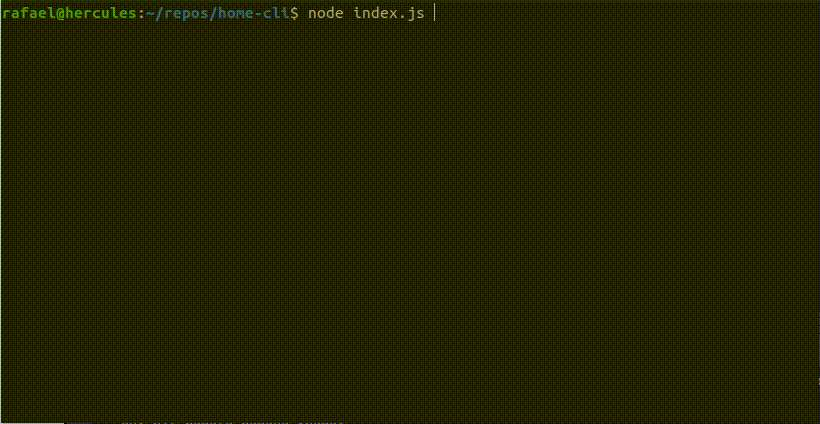

## Home-CLI for eWeLink

Application developed to manipulate your devices in your computer in an interactive CLI.

Just create an `.env` file with the properties on model, then `yarn install` and `node index.js` to run the application.

eWeLink Docs: https://ewelink-api.now.sh/docs/introduction

